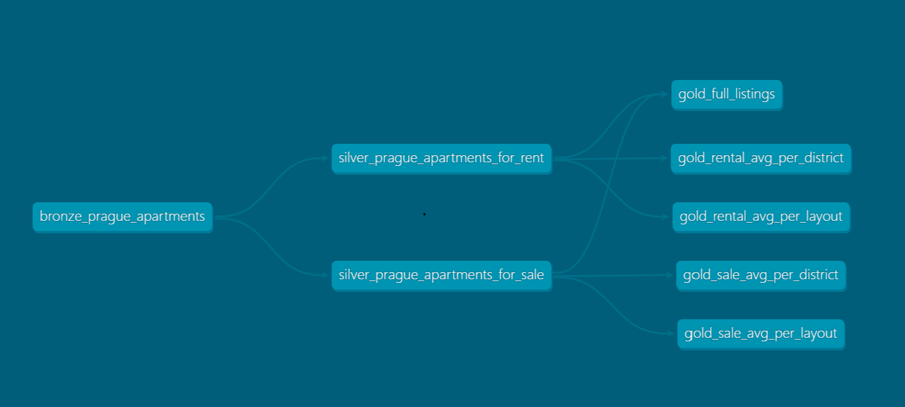
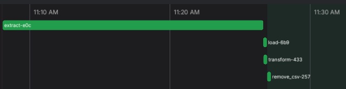

**Prague Apartments Analytics**

This project consists of a lightweight, full-stack data pipeline for collecting, transforming, and visualizing apartment listings in Prague from sreality.cz.

**Streamlit**

https://prague-apartments-analytics.streamlit.app/

**1. Data Ingestion (Scraping)**
Apartment data is scraped using Playwright and saved to a raw CSV file.

**2. Data Transformation (ELT)**
CSV is ingested into Postgres ing dbt.
Follows the medallion architecture:
- **Bronze:** raw → cleaned + deduplicated + atypical listings flagged
- **Silver:** enriched + split by listing type
- **Gold:** analytics-ready tables (4 models)
  
Includes schema management, Jinja templating, and tests via dbt.

Databases: Hosted on Heroku. 1 for development, 1 for production

**3.Visualization**
Final datasets are visualized with Streamlit and Altair.
    - Listings Exploration using sidebar filters
    - Market Analytics with bar charts about real estate market.

**Tech Stack:**
- **Scraping:** Playwright
- **Orchestration:** Prefect (as Airflow alternative)
- **Transformation:** dbt
- **Databases:** Heroku Postgres (Dev + Prod)
- **Logging**: Python logging module
- **Metadata**: dbt docs
- **Visualisation:** Streamlit & Altair

**DBT Lineage:**

**ELT process:** 
- Runs daily at 6 AM UTC
- Consists of 4 tasks: 
1. Extract (Web Scraping)
2. Load (Upload to Postgres)
3. Transform (Execute DBT models)
4. Delete CSV file from memory.

